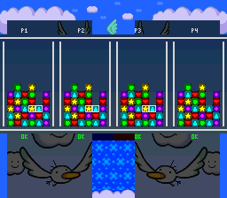
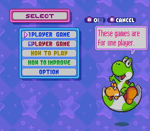

# Tetris Attack 4-Player ROM Hack

An experimental four-player extension for the headerless US SNES release of Tetris Attack, targeting the standard Super Multitap in controller port 2.

This repository does not contain copyrighted ROM data. The build requires a legally obtained source ROM with this fingerprint:

- Filename: `Tetris Attack (USA) (En,Ja).sfc`
- Size: 1,048,576 bytes
- SHA-1: `2dc56eab3e70c0910ae47119d8b69f494e6000df`

Place the source ROM in `resources/`, then run:

```sh
brew install asar
cd romhack
make
```

The generated 2 MiB ROM is written to `romhack/build/tetris-attack-4p.sfc` and is ignored by Git.

With Mesen 2.1.1 installed at the default path used below, run the headless integration tests with:

```sh
make test
```

Set `MESEN_BIN` to use a different Mesen executable.

The current main patch builds reproducibly with Asar 1.91:

- Size: 2,097,152 bytes
- SHA-1: `7bbd4790bee84f1e8dc03c9626b16b344d607d46`

## Progress

Visual milestones are captured from Mesen and checked in under `docs/progress/` as experiments become useful to inspect. ROMs and generated build output remain excluded from the repository.

| Milestone | Status | Visual result |
| --- | --- | --- |
| Four-controller input | Complete | Four independent Multitap words plus processed P3/P4 input state |
| Four-well Mode 2 layout | Complete | Four 6x12 placeholder fields fit across one 256-pixel screen |
| Independent well scrolling | Complete | Each controller drives one Mode 2 vertical offset |
| Balanced P1-P4 board execution | Complete | P1/P3 and P2/P4 alternate through both native slots at equal half-rate |
| Live four-board rendering | Prototype complete | Compact JSON-derived tiles render P1-P4 native/backing panel data |
| Player frames, cursors, and labels | Prototype complete | Thin four-well borders, independent two-cell outlines, and P1-P4 labels |
| Compact status HUD | Prototype complete | Rotating green `OK` and red `!!` danger indicators for all four boards |
| Temporary four-player launch | Prototype complete | Enter normal 2P VS; active match startup auto-arms P1-P4 scheduling |
| Dedicated four-player menu entry | Prototype complete | Main menu visibly offers `4PLAYER GAME` on the working launch route |


The current visual proof deliberately uses flat placeholder tiles. It validates geometry, independent scrolling, and VBlank timing before new panel art is introduced.



The live renderer uploads the JSON-compiled 8x8 tiles and maps all 288 cells from P1/P2 native state plus P3/P4 backing contexts. It includes thin player frames, independent two-cell cursor outlines, compact labels, and top-row danger indicators. It currently refreshes two rows per NMI, completing all four boards every six frames with reliable active-versus VBlank margin. Frame tiles are initialized eight words at a time, while one player's status indicator is refreshed early each NMI.



The main menu's original `2PLAYER GAME` route is visibly relabeled `4PLAYER GAME`. It preserves the proven selection behavior and reaches the auto-armed four-player VS prototype. Level and character setup still use the original two-player screens, so P3/P4 currently inherit the initialized native contexts rather than selecting independently.

For the current playable prototype, configure a Super Multitap in controller port 2 and select `4PLAYER GAME` -> `VS.`. The first active P1 update initializes and arms the balanced four-player scheduler once for that match. Dedicated P3/P4 level and character setup remain pending.

The first compact panel-art export is also available as editable source material:


The sheet order is heart, circle, triangle, star, and diamond. `assets/panels/` contains individual transparent PNGs at both sizes, exact-size contact sheets, and `panels.json` with palette RGB values plus ASCII hexadecimal pixel rows.

Regenerate the assets from a Mesen VRAM/CGRAM dump with:

```sh
ruby tools/export_panel_tiles.rb /path/to/vram.bin /path/to/cgram.bin assets/panels
```

For hand editing, treat `assets/panels/panels.json` as the source of truth and run `make panel-assets`. The 8x8 PNGs are regenerated previews; see [`assets/panels/README.md`](assets/panels/README.md).

### Panel scale

The original panels appear as 16x16-pixel metatiles, which limits a six-column well to 96 pixels. Four such wells would require 384 pixels before borders, so the original scale cannot fit horizontally on a 256-pixel SNES screen.

The four-player renderer instead targets one 8x8 background tile per panel:

- One well: `6 * 8 = 48` pixels wide
- Four wells: `4 * 48 = 192` pixels wide
- Remaining width: 64 pixels for outer borders and three gutters
- Twelve visible rows: `12 * 8 = 96` pixels high

This matches the proven layout at tile columns 1-6, 9-14, 17-22, and 25-30. A 10x10 design would fit mathematically at 240 pixels, but it does not align with the SNES background tile grid and would require significantly more complex rendering. New compact 8x8 panel faces, cursor art, borders, and HUD elements are therefore expected. The game logic and panel identities can remain unchanged; this is primarily a new graphics and tilemap presentation layer.

## Test environment

- Mesen 2.1.1, native Apple Silicon build: verified booting and running through the attract-mode tutorial
- ares v148: installed as an independent accuracy check, but currently advances both the original and patched ROMs at only 1 VPS with a black display on this macOS host

## Current experiment

The first probe expands the ROM to 2 MiB, redirects the controller polling routine at `$80:9C04` to new code at `$A0:8000`, reproduces the overwritten instructions, and rejoins the original routine at `$80:9C10`. It is behavior-neutral and validates the expansion, hook, and Mesen workflow.

The next probe implements protocol-level Super Multitap detection through `$4016/$4017`. Its headless test verifies both sides:

- A Multitap on controller port 2 is detected.
- An ordinary controller on port 2 is rejected.

The manual polling probe now reads all four Multitap subports:

- WRIO bit 7 high selects subports A/B.
- WRIO bit 7 low selects subports C/D.
- Each `$4017` read returns one serial bit for two controllers in bits 0-1.
- The original WRIO value is restored before returning to the game.

Both a deterministic bus test and an end-to-end Mesen Multitap device test verify four distinct 16-bit controller words. Raw experimental state is stored at `$7F:FE00-$7F:FE09`. An untouched-game trace found no accesses to `$7F:FE00-$7F:FE2F` during 3600 steady-state frames after startup initialization.

The main patch now also maintains P3/P4 current, newly pressed, repeated, previous, and repeat-timer state. Deterministic tests verify first press, held input, release, initial repeat delay, and repeat cadence reset against the original game constants.

## Rendering research

The `static-four-wells` experiment proves the proposed horizontal layout on the SNES renderer:

- Four 6x12 wells consume 24 of the 32 tile columns.
- Two-column gaps separate the wells.
- BG2 carries the decorative background and experimental well fields.
- BG3 supplies Mode 2 offset-per-tile data.
- Four six-column groups share a level zero-offset baseline and can then scroll independently.

The experiment is now stateful. Each raw Multitap word controls one well's vertical offset: Up decrements and Down increments its 10-bit scroll value. A headless test independently drives all four controller words and verifies both the WRAM state and resulting BG3 offset groups.

The renderer must run earlier than controller polling. A late controller-hook experiment reached the end of VBlank after only 20 offset words. Hooking both active NMI branches immediately after the existing `$80:90F3` call provides enough time for all 288 well entries and 32 offset words. The experiment preserves the displaced call and is not part of the production patch.

`make test` verifies the four-well geometry, static offset table, and four independent input-driven transitions directly in Mesen WRAM/VRAM. Generated screenshots and ROMs remain ignored by Git.

The `multitap-auto-read` experiment routes P1 through `$421E` to investigate automatic reads from the Multitap's second data line. Its automated button-input test is currently inconclusive because Mesen 2.1.1's Lua `setInput` path does not update the SNES serial shift buffer in this headless workflow.

See [`notes/rom-map.md`](notes/rom-map.md) for confirmed addresses.
See [`notes/board-engine.md`](notes/board-engine.md) for the two-player context layout and four-player execution strategy.
